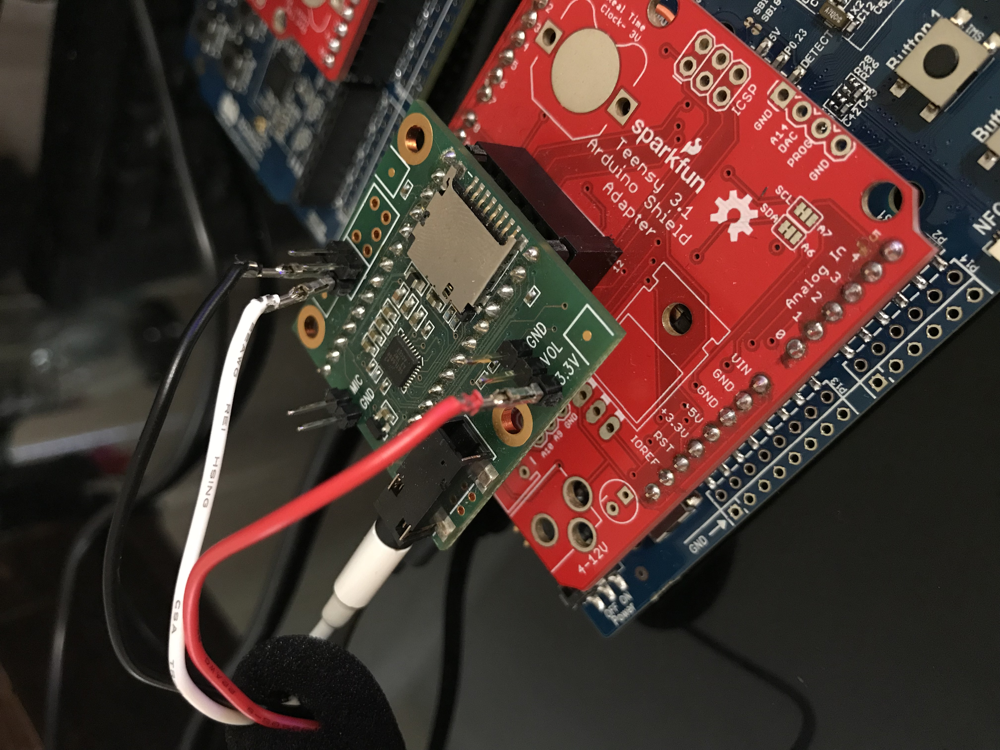
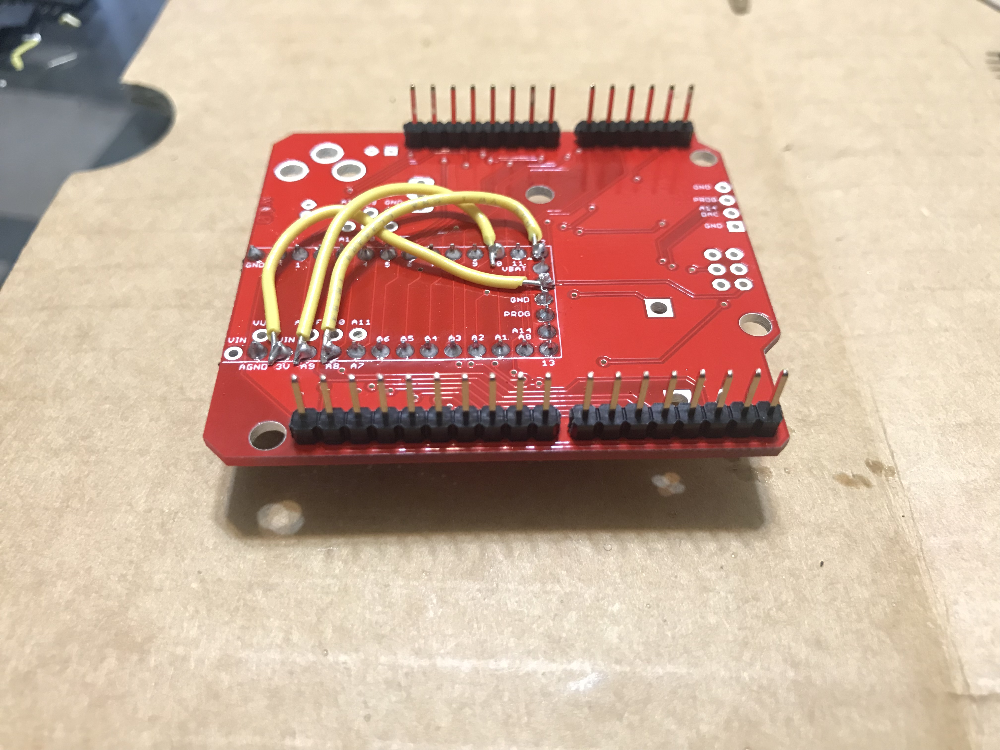
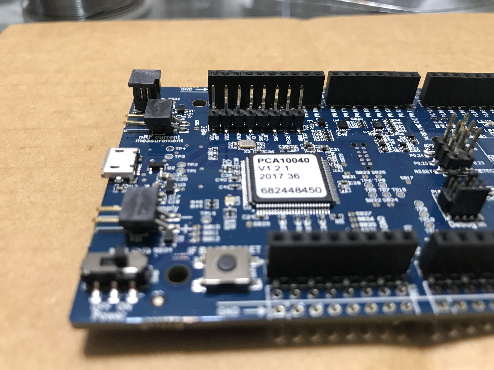
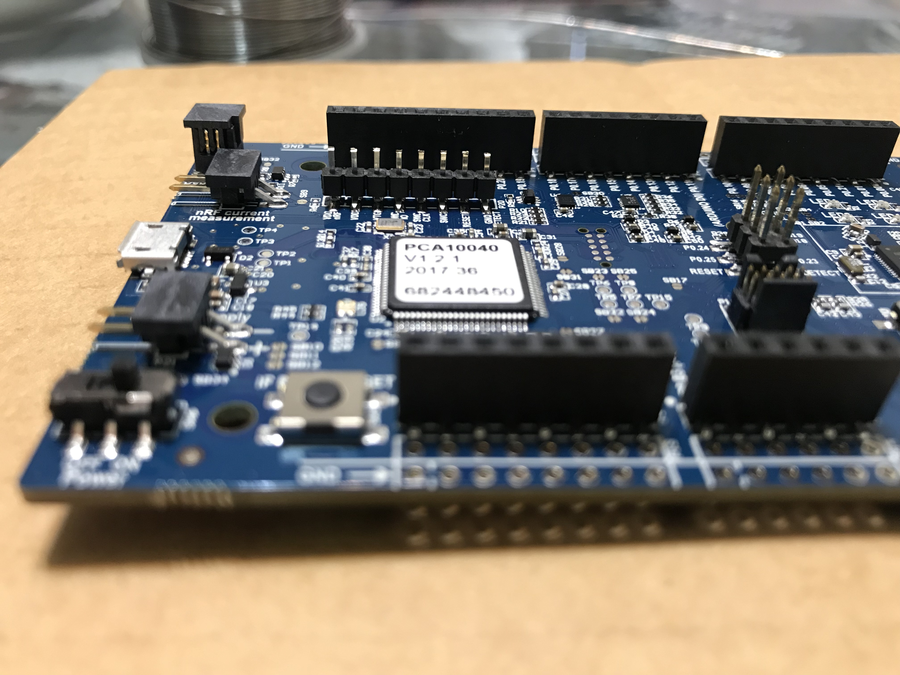
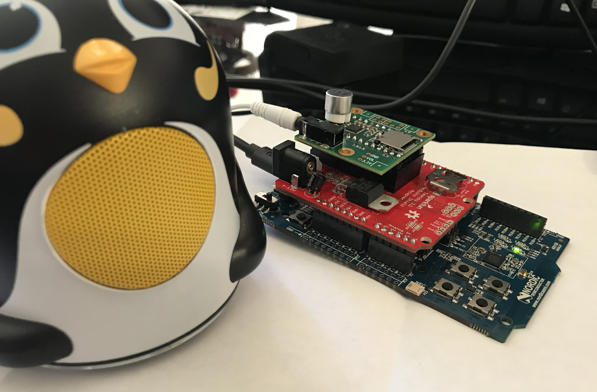

# nRF52-teensy-sgtl5000-audio

This repository contains example source code that can be used together with a nRF52-DK
to interface and use a Teensy SGTL5000 Audio adapter board. A Teensy Arduino Shield Adapter with 
some modifications are used to connect the audio board to the DK. A standard MIC input 
microphone, or a LINEIN MEMs microphone is used for microphone input.

This example basically just shows how the I2S peripheral (along with the TWI) can be used
to interface an audio device to retrieve and send audio data. 

Components used for this example:
- nRF52-DK, https://www.nordicsemi.com/eng/Products/Bluetooth-low-energy/nRF52-DK (nRF52840-DK can also be used)
- Teensy Audio Adapter Board, https://www.pjrc.com/store/teensy3_audio.html
- Teensy Arduino Shield Adapter, https://www.sparkfun.com/products/13288
- MIC Microphone: I unfortunately do not have any datasheet or reference to the microphone that was used 
for this example. It looks like a standard MIC/GND microphone. See image [What to expect](#What-to-expect) for reference.
- Option instead of MIC microphone: LINEIN MEMS Microphone SPW2430, https://www.amazon.com/gp/product/B015HKGPCY/
    - If you are using these MEMEs microphones, adding a windscreen make the audio a whole lot better. I used these http://a.co/9Ozps5X.

<dl>
  <dt>UPDATE:</dt>
    <dd> 
      Support for the nRF52840-DK has now been added!
    </dd>
</dl>

## Comments
<dl>
  <dt>I2S MCLK Frequency</dt>
    <dd> 
    The nRF52832 is set up to run I2S at 4MHz during normal I2S operation (the maximum of 
    nRF52832), while the datasheet for the SGTL5000 specifies 8MHz as the minimum frequency (at least as far as I 
    could tell). When configuring the SGTL5000, the I2S MCLK speed on the nRF52832 is raised to above the nRF52832 defined 
    maximum. This has been tested and works for this demo purpose, but for an actual product you might want 
    to stay within the specified limits of the audio device that you are going to use.
    </dd>

  <dt>Audio Volume</dt>
    <dd> 
    The volume output of this demo could be fairly HIGH depending on the microphone/speakers
    that are being used. Please be aware of this and don't put your headphones into your ears before you 
    have tested the output volume level!
    </dd>

  <dt>Microphone Input</dt>
    <dd> 
    The original MEMS microphone that this example was developed for has not recently been tested with the 
    final source revision (this repository). Although its assume to work given you alter the drv_sgtl5000.h
    to use LINEIN instead of MIC input, this has not been tested nor verified. Please let me know if you do, 
    and I will update this repository to include your results :)
    </dd>
</dl>


## Running the example
To run this example on the nRF52-DK (nRF52832-DK, or the nRF52840-DK - pin definitions might differ for this board), a couple of things has to be set up.

Please note the volume level warning as noted earlier. Depending on your microphone and speakers, 
certain dB settings in the header/source driver files might have to be changed to provide an acceptable 
volume level. 


### Prepare the Teensy Audio Adapter Board
The Teensy audio adapter board, SGTL5000, needs to have either a standard MIC/GND microphone, or a 
MEMS LINEIN microphone soldered on. If you are using the MIC/GND connection, you will basically just 
solder on the microphone there. If you are using a LINEIN microphone, you will need to solder it onto 
the LINEIN G,R,G,L on the side of the adapter. See image below where only the Left LINEIN channel is used.
In this image, you can also see that 3V3 from the adapter is used to power the MEMS microphone. For the 
MEMS that was used in this demo, SPW2430, I believe the 3V, GND, and AC connections were used to get the 
audio data - yet to be verified by someone (Y)

<div class="row">
  <div class="column">
    
  </div>
</div>

On one of my setups, I had to cut off pin 12 - MISO, and pin 10 - SDCS from the audio board headers, as these will 
interfere with the routed signals of the Teensy shield adapter (see preparing the Teensy Arduino Shield Adapter). 
I have tested this demo without cutting these pins, and it seems to work fine, but if you experience 
any issues, please consider cutting these off the Audio board so that they don’t connect to the Shield Adapter. 


### Prepare the Teensy Arduino Shield Adapter
The Teensy Arduino Shield Adapter needs to be modified slightly due to the GPIO setup of the adapter. When the 
SGTL5000 audio board is placed upon the shield, LRCLK ends up on A9, and TX ends up on A8. Since these are not connected
to any of the shields header pins that will connect to the nRF52-DK, we need to route/jump these two signals (as well as 3V3) to some other pins.
The audio board pins connecting to D10 and D12 are not in use, so we can route LRCLK to D10, and TX to D12 (see note about cutting original D10/D12 pins on the audio board above - this is probably not necessary, but might be needed if you experience any issues). We also need to connect the audio board 3V3
pin to the 3V3 of the shield.

So the following connections have to be made on the shield: **VIN/3V <-> 3.3V**, **A9 <-> 10**, **A8 <-> 12**. When the connections are made, 
it should look like the image below. Using a thinner wire might be beneficial, but for illustration purposes, the fat yellow one looks better ;)

<div class="row">
  <div class="column">
    
  </div>
</div>


### Prepare the nRF52-DK
Due to the length of the nRF52-DK pins of the P20 header, they must be cut so that they don't touch the 
bottom of the Teensy Arduino Shield. I used a couple of hours trying to understand why one of my DKs didn't work,
until I discovered that the P20 header was touching the shield's pins! These can be cut as low as you want, just make sure they 
don't touch the bottom of the shield when the shield is placed on top of the DK. See photo below.
 
<div class="row">
  <div class="column">
    
  </div>
  <div class="column">
    
  </div>
</div>

Information on the P20 Header can be found here: [Infocenter DK P20](http://infocenter.nordicsemi.com/topic/com.nordic.infocenter.nrf52/dita/nrf52/development/nrf52_dev_kit/hw_debug_out.html?cp=2_1_4_5_9)


### Run the example
One all the modification as listed are done (Audio board, Teensy Shield, and nRF52-DK), you are ready to test it! 

**Please make sure you have seen the comment on volume level, so please don't stick any earplugs into your 
ears before you know the volume level of the playback.**


#### Connecting everything together
- Connect the SGTL5000 Audio board to the Teensy Shield
- Connect the Teensy Shield to the nRF52-DK
- Connect a speaker or headphone to the jack plug on the audio board
- Upload precompiled .hex file found in the repository, "teensy_sgtl5000_audio_pca10040.hex", to the nRF52-DK
    - See for example [Command line programming nRF parts](http://infocenter.nordicsemi.com/topic/com.nordic.infocenter.tools/dita/tools/nrf5x_command_line_tools/nrf5x_nrfjprogexe.html?cp=5_1_3)


#### What to expect
When the application is running, the first thing you should hear is a car sound sample being played - twice. If you want
to make sure the playback is correct, play the sample located in this repository on your computer first, then you know how
it should sound. After the 
sample is played, the application will go into playback mode, where anything input on the microphone, will be played back
on the speaker. Test this by speaking or blowing into the microphone, and it should be played on the speaker. The sample is 
played twice because two methods of playing it are shown in the source - you can have the driver take care of it, or use 
the application's driver event handler to play it. 

The complete setup should look like the image below (please note that a standard MIC is used here instead of the LINEIN MEMs microphone):

<div class="row">
  <div class="column">
    
  </div>
</div>


## Compiling and Developing
This example is built with SDK v15.0.0. This can be downloaded here: http://developer.nordicsemi.com/nRF5_SDK/. 

The example assumes a location of this repository matching the following path for this readme.
```
...\nRF5_SDK_15.0.0_a53641a\examples\peripheral\nRF52-teensy-sgtl5000-audio\README.md
```


### Development Environment
There is both Keil and SES project files that can be used for development. Please note that if you use one for 
development and not the other, I would recommend deleting the one that is not used to avoid confusion at a later 
stage when you might think both projects in the repository are up to date - but in fact they are not.

If you would prefer to use ARMGCC and makefiles, etc. I recommend copying the I2S peripheral example setup from 
SDK v15.0.0, then modifying this to include the TWI driver source, the new SGTL5000 driver source, and the 
.wav c-file sample source. That is really all that should have to be done, but of course there might be some 
other modifications necessary to get it working. If you do make this, please create a pull request and I will 
include it in my repository as well :)


### SGTL5000 Driver Alterations
If you need to change anything related to the SGTL5000 driver, this should be done in the drv_sgtl5000.c/.h files. 
Every GPIO that is used for the audio board is defined in the header. 

The header file also defines some of the dB settings 
that are used. If the microphone input is too high or low, please have a look at this header (as well as the source)
and change the values accordingly. 

If you would like to use the LINEIN microphone input instead of MIC input, 
change AUDIO_INPUT_LINEIN definition to 1, and AUDIO_INPUT_MIC to 0. This has not been verified in the latest source
version, but it should be working. 


### Developing an Audio Application with this Driver
If you would like to use this driver/framework to develop your own application, such as for example streaming 
audio between two DKs over BLE, this SGTL5000 driver can be used for that purpose. What you would basically do,
is initialize the driver as shown in the example, start the driver by calling `drv_sgtl5000_start()` - which 
will basically start the driver and forward any received I2S data to the application as well as request I2S TX 
data from the application. The driver event handler that needs to be changed to match your use-case is then the 
`drv_sgtl5000_init_t.i2s_evt_handler`, defined as `i2s_sgtl5000_driver_evt_handler` in the example. In this event 
handler, you would respond to the events `DRV_SGTL5000_EVT_I2S_RX_BUF_RECEIVED` and `DRV_SGTL5000_EVT_I2S_TX_BUF_REQ`.

So, for example, when you receive a `DRV_SGTL5000_EVT_I2S_TX_BUF_REQ` event you would pull audio data from a queue, and then copy this 
into the TX buffer so that it is played. When you receive `DRV_SGTL5000_EVT_I2S_RX_BUF_RECEIVED`, you would handle this data in some way.
A use-case for this is to send the RX_BUF data received (either compressed or uncompressed - depending on the BLE throughput between 
the two devices) over BLE (Nordic UART Service) to another DK. 
This other DK would then store the received RX bufs in a queue and play these whenever requested by the I2S peripheral,
and vice versa - this way, you would have a two-way BLE walkie-talkie, amazing right!:D


## nRF52832 SGTL5000 Driver Resource Usage
The SGTL5000 driver will use TWI instance 1 (can be modified to use another in the driver header if needed)
and the I2S peripheral. It will also use EGU instance 3 to stop the I2S peripheral when needed.

## nRF52832 Driver GPIO Usage
All GPIOs are predefined in the drv_sgtl5000.h header file. See header for definitions. 

## Audio Conversion
To convert the audio recording used as a sample in this example to a .wav file, the following 
tool was used https://audio.online-convert.com/convert-to-wav.

To convert the .wav file to a sample .c source file, the python script Convert Audio Sample\conv.py
can be used. Follow the instructions as specified within that folder to create the sample .c file.
